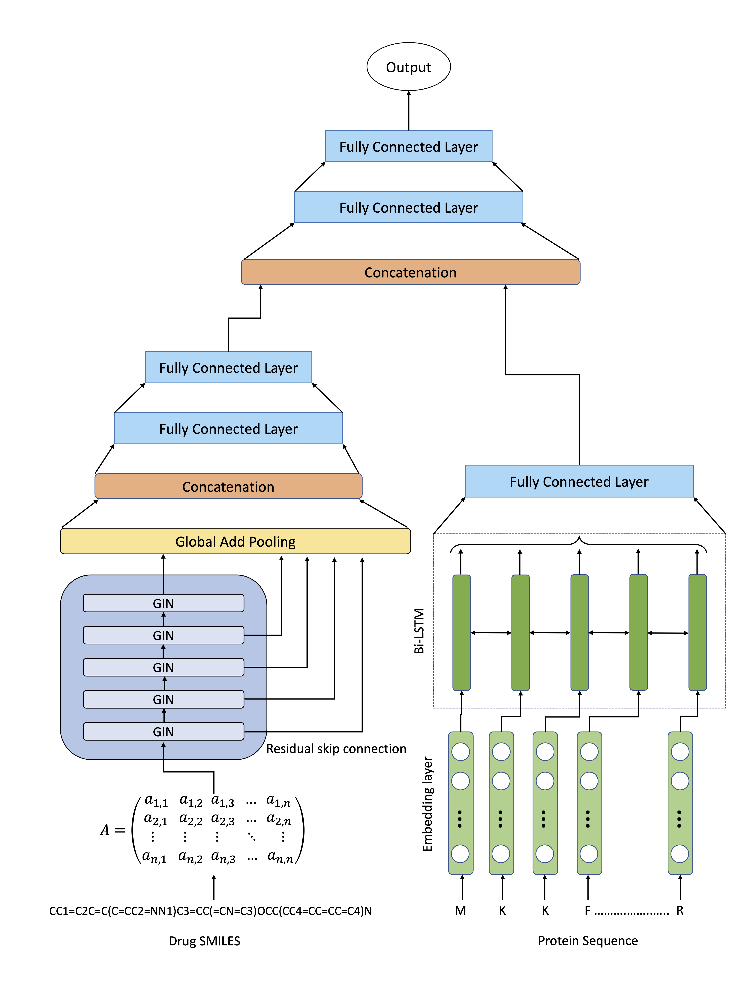

# ResGLSTM: Residual Graph Isomorphism Network and LSTM based approach for drug-target binding affinity prediction

## Model Architecture <a name="Model-Architecture"></a>


## Preparation <a name="prepration"></a>
### Environment Setup <a name="env-setup"></a>
The dependency pakages can be installed using the command.
```shell
pip install -r requirements.txt
```
### Dataset description <a name="dataset"></a>
In our experiment we use Davis, KIBA and Metz datasets respectively.

## Quick Start <a name="model-tra"></a>
### Create Dataset <a name="create-dataset"></a>
Firstly, run the script below to create Pytorch_Geometric file. The file will be created in processed folder in data folder.
```shell
python data_creation.py 
```
### Model Training  <a name="model-tra"></a>
Run the following script to train the model.
```shell
python training.py 
```
Default values of argument parser are set for davis dataset.
### Inference on Pretrained Model  <a name="Inf-pre"></a>
Run the following script to test the model.
```shell
python inference.py 
```
Default values of argument parser are set for davis dataset.